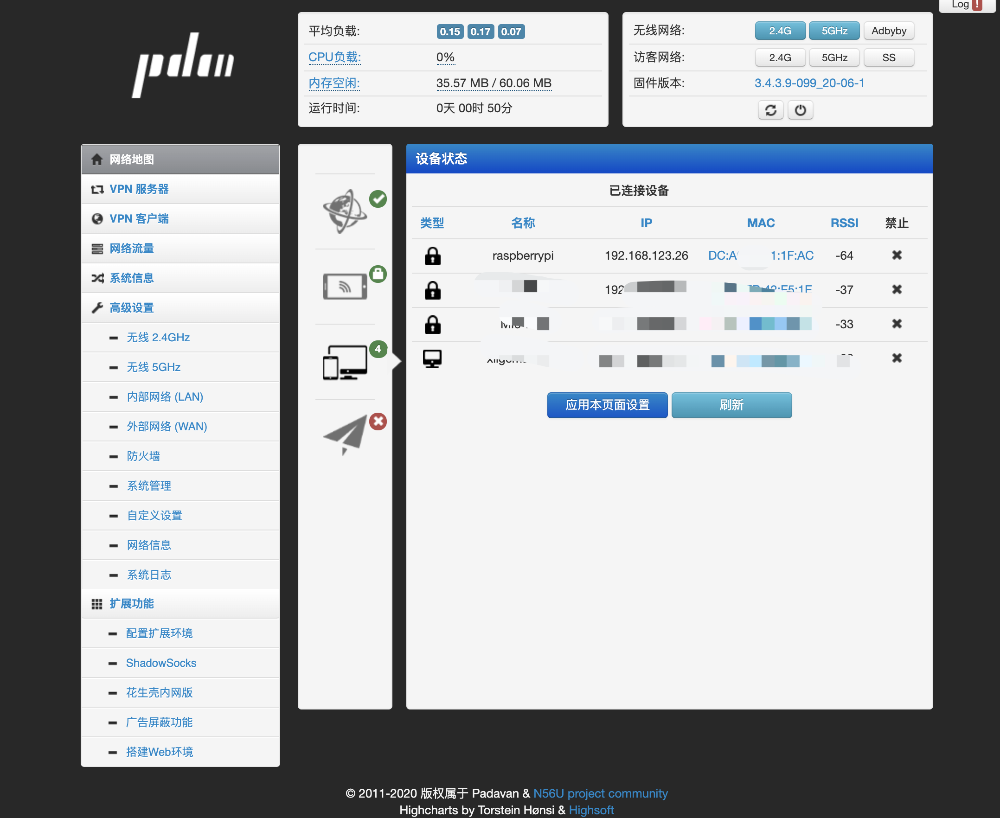
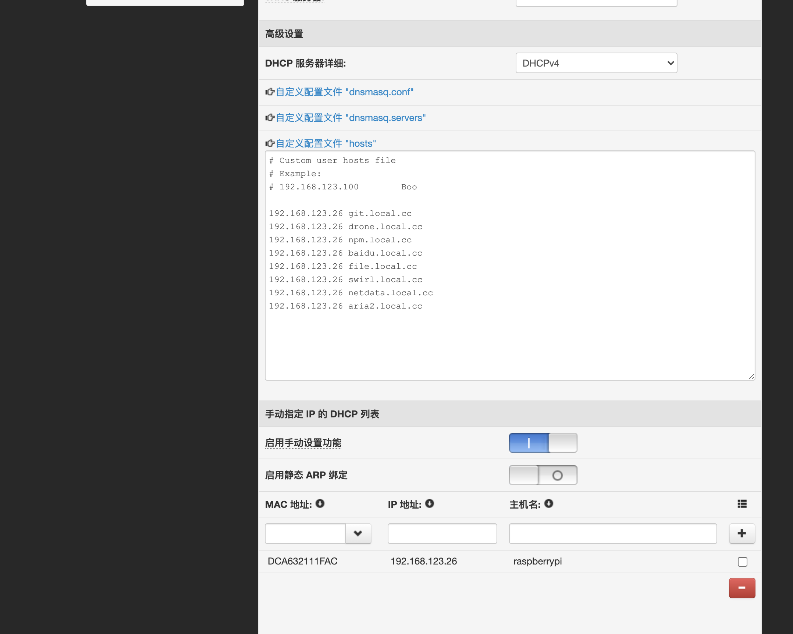
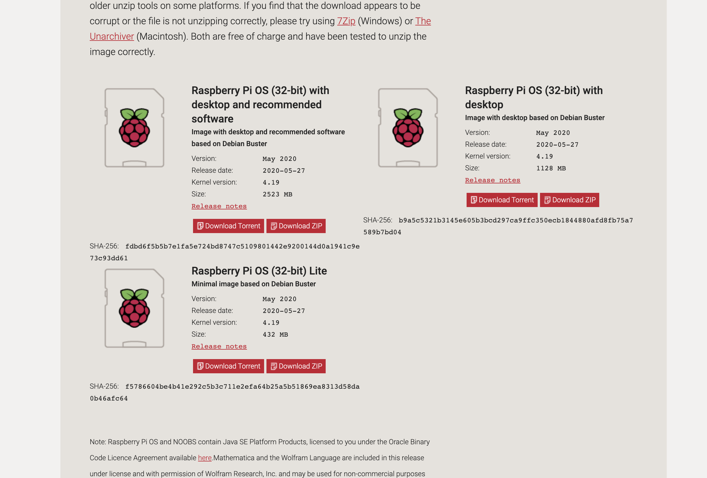
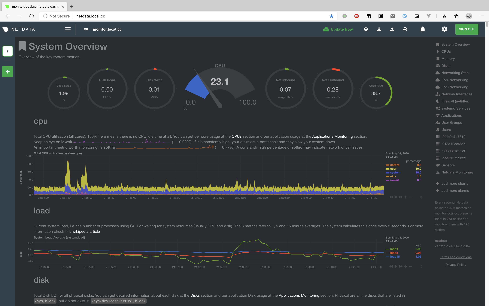
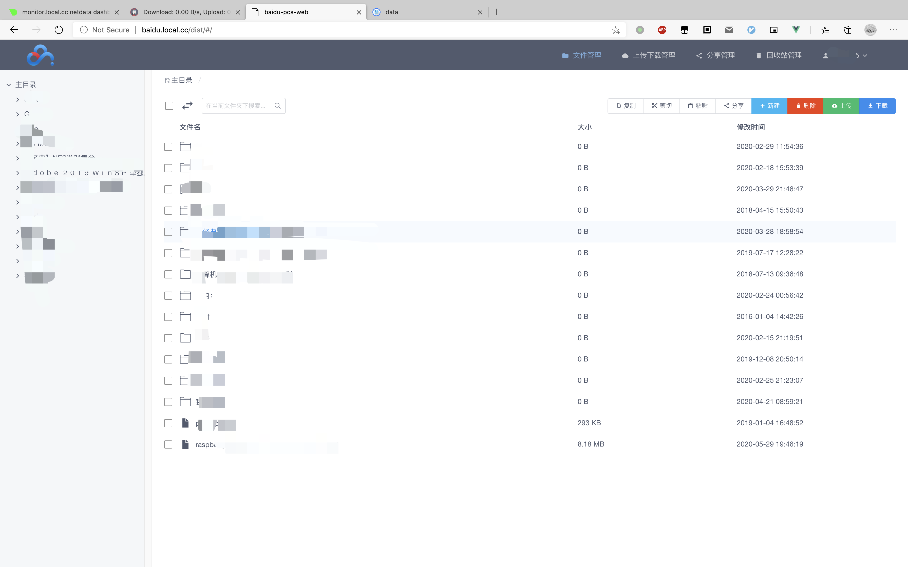
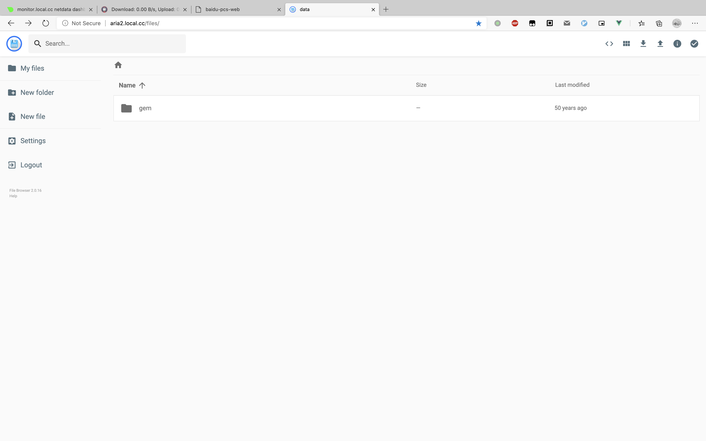

一直都想部署一个局域网服务，保存自己下载的电影、图片等等。空闲的时候，还能挂着下载东西。

一直没空，刚好这个周末有空，就尝试在树莓派 4 上面部署 Docker 服务。配合路由器修改 hosts 用着还不错。

所需硬件：

- 树莓派 4B 1GB x1
- 斐讯 K2 路由器 x1
- 一台电脑（笔记本/台式机都行）

<!-- more -->

## 路由器刷固件

路由器刷 Padavan 固件(默认用户名/密码是: admin/admin)，可以刷其它固件，只要又绑定 mac 地址功能，和自定义 hosts 功能即可。



树莓派的地址是 192.168.123.26, 记住后面有用



在「内部网络 -> DHCP 配置」中绑定 MAC 地址，以及设置 hosts，到这里，路由器的配置就结束啦。重头戏还是在树莓派里面。

## 树莓派 Docker 服务

树莓派刷入官方固件

下载地址：https://www.raspberrypi.org/downloads/raspbian/

建议下载 recommend 版本，有 GUI 好用一点点。我就用联了个网，后面基本也没用过 GUI :)

安装好之后，联入路由器，开启 ssh 登陆，然后就可以在电脑上用 ssh 工具登录树莓派。



准备工作，由于在国内，安装软件，以及拉取镜像等操作都可能因为网络原因失败，所以第一步就是替换软件源地址

1. 替换树莓派 Debian 软件源，替换成清华的源地址

修改方式参考：https://mirror.tuna.tsinghua.edu.cn/help/raspbian/

2. 安装 Docker

使用官网的安装脚本：https://github.com/docker/docker-install

国内可用阿里云的镜像地址来安装：

```sh
curl -fsSL https://get.docker.com -o get-docker.sh
sh get-docker.sh --mirror Aliyun
```

安装完之后，再安装 Docker-Compose：

```sh
sudo apt update
sudo apt install docker-compose
```

安装完之后，记得修改 Docker Hub 的镜像地址：

修改成中科大的地址，修改方式：https://mirrors.ustc.edu.cn/help/dockerhub.html

到此，Docker 环境就安装好啦。

## 部署 Docker 服务

推荐使用 Docker-compose 来部署服务，因为 docker-compose 可以把配置写到文件中，不用每次启动都输入一遍配置。

可选在树莓派上安装 Nginx 反向代理服务，如果不安装在树莓派上，可以在 Docker 中运行 Nginx，只不过，因此 Docker 中其它服务都必须在同一 network 上。

Docker 相关配置参考：https://github.com/cwxyz007/Dockerfiles

## 最终效果

以下服务只能在局域网里面访问，而且因为 Nginx 反向代理加上路由器 hosts 的原因，需要正确的域名才能访问到对应的服务。注意需要用路由器默认 dns，否则 hosts 不会生效。

看看部署好的服务吧：

netdata 监控服务



aria2 下载服务


百度网盘服务



文件浏览服务



到此就可以愉快的玩耍啦

Docker 配置和操作请参考：https://docs.docker.com/reference/
